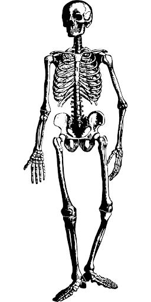
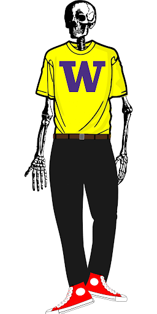
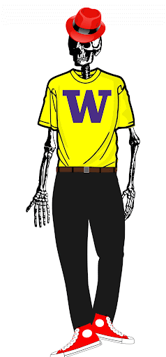
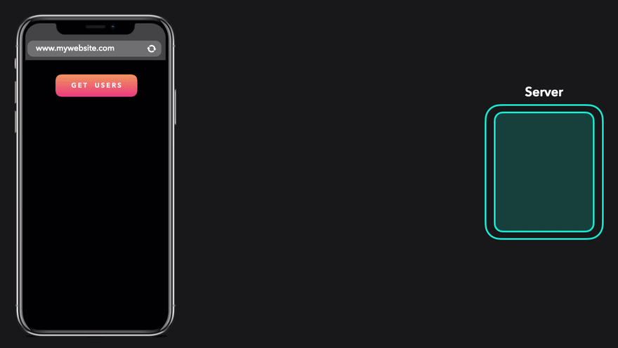

<!--
author:   Andrea Charão

email:    andrea@inf.ufsm.br

version:  0.0.1

language: PT-BR

narrator: Brazilian Portuguese Female

comment:  Material de apoio para a disciplina
          ELC1090 - Desenvolvimento de Software para Web
          da Universidade Federal de Santa Maria

translation: English  translations/English.md
-->

<!--
liascript-devserver --input README.md --port 3001 --live
https://liascript.github.io/course/?https://raw.githubusercontent.com/AndreaInfUFSM/elc1090-2024a/master/classes/02/README.md
-->


[](https://liascript.github.io/course/?https://raw.githubusercontent.com/AndreaInfUFSM/elc1090-2024a/master/classes/02/README.md)


# Web Basics

Para começar, uma analogia!

Simplificando, podemos resumir a Web em 4 itens: 

Conteúdo, Estrutura, Estilo, Comportamento

  
  
  
  


## Protocolo HTTP

Falando mais tecnicamente... 

Web é uma aplicação de protocolos de rede e de linguagens


Arquitetura cliente-servidor 

- Conceito de sistemas distribuídos (antes da Web)
- Classicamente, browser é cliente (user-agent) que faz requisições aos servidores
- Protocolo HTTP (HyperText Transfer Protocol) define regras para esta interação


Mais animadamente:



Fonte: https://dev.to/lydiahallie/cs-visualized-cors-5b8h


Mais sobre HTTP em: 

- Mozilla. An overview of HTTP. https://developer.mozilla.org/en-US/docs/Web/HTTP/Overview
- Barry Pollard. HTTP/2 in Action. https://www.amazon.com/dp/1617295167?tag=uuid10-20&asin=1617295167&revisionId=&format=4&depth=1

### URL

- Requisições HTTP acessam **recursos** na web
- Uniform Resource Locator (URL) identifica recursos na web 
- Geralmente, quando falamos de "endereço web", estamos nos referindo a uma URL
- Principais elementos na escrita de URLs (sintaxe):


Mais sobre isso em: https://developer.mozilla.org/en-US/docs/Web/HTTP/Basics_of_HTTP/Identifying_resources_on_the_Web

### Requisições/respostas

Mensagens HTTP que trafegam pela rede são requisições ou respostas.

Exemplo de requisição enviada pelo cliente:


Exemplo de resposta do servidor:


Mais sobre isso em: https://developer.mozilla.org/en-US/docs/Web/HTTP/Messages


## Browser e DOM

Navegadores modernos são quase um "sistema operacional" :-)

Este tutorial aprofundado (Inside look at modern web browser) começa explicando threads e processos:

- Part 1: https://developer.chrome.com/blog/inside-browser-part1/
- Part 2: https://developer.chrome.com/blog/inside-browser-part2/
- Part 3: https://developer.chrome.com/blog/inside-browser-part3/
- Part 4: https://developer.chrome.com/blog/inside-browser-part4/

[Document Object Model](https://developer.mozilla.org/en-US/docs/Web/API/Document_Object_Model): *connects web pages to scripts or programming languages by representing the structure of a document*

Ilustração (part 3): The main thread parsing HTML and building a DOM tree


## HTML

- Hypertext Markup Language (HTML)
- Descreve conteúdo + estrutura de uma página web
- Usa *tags* para estruturar o conteúdo (início e fim) 

Exemplo (HTML5):

```html
<!DOCTYPE html>
<html>
  <head>
    information about the page
  </head>
  <body>
    <header>
      <!-- Header of the webpage body (e.g. logo, navigation bar) -->
    </header>
    <main>
      <!-- Main section of the webpage body (where most content is) -->
      <p>This is a paragraph</p>
    </main>
    <footer>
      <!-- Footer of the webpage body (e.g. copyright info) -->
    </footer>
  </body>
</html>
```


Mais em:


- https://developer.mozilla.org/en-US/docs/Learn/HTML/Introduction_to_HTML/Getting_started
- https://developer.mozilla.org/en-US/docs/Learn/HTML/Introduction_to_HTML/Document_and_website_structure
- https://developer.mozilla.org/en-US/docs/Web/HTML/Element
- https://developer.mozilla.org/en-US/docs/Learn/HTML/Howto
- https://www.w3schools.com/html/

## CSS

- Cascading Style Sheets (CSS)
- Descreve a aparência e o layout de uma página web (complementando HTML, que descreve o conteúdo/estrutura)
- Especificações: https://www.w3.org/Style/CSS/specs.en.html
- Código em arquivo .css referenciado no .html

                 {{1}}
************************************************
Link no HTML

Exemplo no `<head>`:

```html
<head>
  ...
  <link rel="stylesheet" href="https://maxcdn.bootstrapcdn.com/bootstrap/3.4.1/css/bootstrap.min.css">
  ...
</head>  
```
************************************************


                 {{2}}
************************************************
Rules = selectors + properties


- Arquivo CSS = uma ou mais regras (rules)
- Básico: rules = selectors + properties

  - Selector: quais elementos da página devem ser estilizados (https://developer.mozilla.org/en-US/docs/Web/CSS/Reference#selectors)
  - Property: estilos que serão aplicados aos elementos
- Cada property tem um conjunto de valores possíveis
- Muuuitas propriedades: https://developer.mozilla.org/en-US/docs/Web/CSS/Reference

Forma geral:

```css
  selectors-list {
    properties-list
  }
```

Exemplo:

```css
  strong {
    color: red;
  }
```

- `strong`: seletor
- `color`: propriedade
- `red`: valor da propriedade

Outro exemplo:


Mais em:

- https://developer.mozilla.org/en-US/docs/Learn/Getting_started_with_the_web/CSS_basics
- https://developer.mozilla.org/en-US/docs/Learn/CSS/Howto
- https://www.w3schools.com/css/default.asp


************************************************


# Static Websites

Web site é software?

[(sim)] Sim
[(nao)] Não


                 {{1}}
************************************************

- O que é exatamente um "site estático"?
- Segundo Wikipedia: *"a web page that is delivered to a web browser exactly as stored"* (https://en.wikipedia.org/wiki/Static_web_page)
- Outras definições:

  - https://www.w3schools.com/howto/howto_website_static.asp
  - https://www.sanity.io/static-websites

************************************************  


## Usos


- Páginas pessoais
- Portfolios pessoais ou corporativos
- Landing pages
- Sites de documentação
- Brochure sites

## Desenvolvimento

Básico:

- conteúdo
- criação

  - estrutura; código HTML
  - estilo: código CSS
- hospedagem/publicação/deploy


### Criação

- Editar manualmente HTML, CSS (pouco produtivo, mas vale fazer algumas vezes na vida)
- Aproveitar frameworks facilitadores, por exemplo:

  - Bootstrap: https://getbootstrap.com/ https://www.w3schools.com/bootstrap/
  - Tailwind: https://tailwindcss.com/ 
  - Ver: https://ritza.co/articles/tailwind-css-vs-bootstrap-vs-material-ui-vs-styled-components-vs-bulma-vs-sass/
- Static site generators: https://jamstack.org/generators/ 
- Abordagem moderna: JAMStack: JavaScript, API, Markup (para quem já sabe o básico)
- Para quem trabalha na área, vale olhar: https://www.netlify.com/blog/complete-guide-to-headless-cms/

### Hospedagem

Muitas opções de hospedagem gratuita:

- GitHub Pages

  - Exemplos: https://gsajulia.github.io/  https://lorenzofman.github.io/

- Vercel
- Render
- Netlify
- Repl.it
- Muitos outros...

Na inf.ufsm.br:

- Entrar com seu usuário em ssh.inf.ufsm.br 
- Copiar arquivos para a pasta public_html
- Exemplo: http://www-usr.inf.ufsm.br/~rtrindade/

  - Atualmente: https://br.linkedin.com/in/rafael-gauna-trindade


## Cases


A seguir, alguns exemplos com características de sites estáticos (nem todos são realmente estáticos)

Começaremos por sites profissionais **santamarienses** e no final alguns cases aleatórios pelo mundo afora

                 {{1}}
************************************************

**Saúde**

Será que são sites estáticos?

- https://iortsm.com.br/
- https://www.icardio.com.br/
- https://www.clinicamedspa.com.br/
- https://alcidesvogel.com.br/
- https://draandrearechia.com.br/

************************************************


                 {{2}}
************************************************

**Agro**

Será que são sites estáticos?

- https://irrigaglobal.com/br/
- https://cowmed.com.br/
- https://www.drakkar.com.br/
- https://agrimec.com.br/

************************************************


                 {{3}}
************************************************

**Comunicação e marketing**

Será que são sites estáticos?

- https://www.finish.com.br
- https://toca.cc/
- https://wp8.com.br/
- https://ouseweb.com.br/
- https://www.flync.com.br/
- https://criapolis.com.br/


************************************************


                 {{4}}
************************************************
**Engenharia e Arquitetura**

Será que são sites estáticos?

- https://www.construtorajobim.com.br/
- https://dbgraus.com.br
- https://www.lineastudio.com.br/


************************************************


                 {{5}}
************************************************
**Organizações**

Será que são sites estáticos?

- https://www.geoparquequartacolonia.com.br/
- https://www.hotelitaimbe.com.br/
- https://www.cdlsm.com.br/


************************************************


                 {{6}}
************************************************

**Outros**

Será que são sites estáticos?

- https://www.nytimes.com/interactive/projects/well/workouts/
- https://survey.stackoverflow.co/2022/
- https://alvarotrigo.com/blog/web-developer-portfolio-examples/


************************************************


# Mais cases


Sugestões da turma e da professora:

1. https://refactoring.guru/ 
2. https://codepen.io/
3. https://css-tricks.com/snippets/css/a-guide-to-flexbox/
4. https://brutalist-web.design/
5. https://www.kto.com
6. https://news.ycombinator.com
7. https://medium.com/ 
8. https://aws.amazon.com/
9. https://gifcap.dev/
10. https://chicorei.com/
11. https://www.ufsm.br
12. [Painel de Monitoramento do Plano Nacional de Educação](https://app.powerbi.com/view?r=eyJrIjoiOGY5NWUyMDMtYzc0Mi00Y2Y5LTk3MmEtNThjMjJiY2NjNWExIiwidCI6IjI2ZjczODk3LWM4YWMtNGIxZS05NzhmLWVhNGMwNzc0MzRiZiJ9)
13. https://survey.stackoverflow.co/2023/
14. https://www.nytimes.com/interactive/projects/well/workouts/
15. https://andreainfufsm.github.io/ps2-2020b/
16. Esta página aqui que você está vendo!


Perguntas:

- O que podemos dizer destes cases quanto a: conteúdo, estrutura, estilo, comportamento?
- O que podemos descobrir sobre eles com F12?

