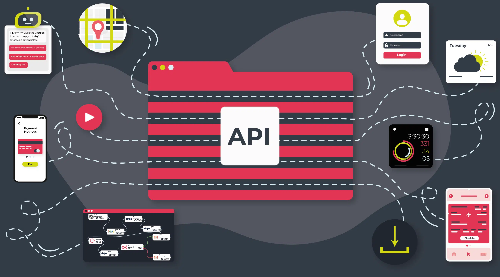

<!--
author:   Andrea Charão

email:    andrea@inf.ufsm.br

version:  0.0.1

language: PT-BR

narrator: Brazilian Portuguese Female

comment:  Material de apoio para a disciplina
          ELC1090 - Desenvolvimento de Software para Web
          da Universidade Federal de Santa Maria

translation: English  translations/English.md
-->

<!--
liascript-devserver --input README.md --port 3001 --live
https://liascript.github.io/course/?https://raw.githubusercontent.com/AndreaInfUFSM/elc1090-2023a/master/classes/08/README.md
-->

# Segundo projeto

> Objetivo: Criar aplicação web consumindo API pública (sem autenticação) 

Fonte: https://cyclr.com/blog/getting-ahead-in-the-api-economy

## Temática

Entre no "mood" da temática:  **conhecimento**

<iframe title="Segundo projeto web 2024a" frameborder="0" width="1200" height="675" style="position: absolute; top: 0; left: 0; width: 100%; height: 100%;" src="https://view.genial.ly/6612cf1d6011630014fe22cd" type="text/html" allowscriptaccess="always" allowfullscreen="true" scrolling="yes" allownetworking="all"></iframe> 
 

Alguns links:

- https://quizapi.io
- http://download.basenacionalcomum.mec.gov.br/
- https://cientificar1992.pythonanywhere.com/visualizarBncc/
- https://www.univates.br/ppgece/media/pdf/2015/Atividades_semelhantes_a_Prova_Brasil__5_e_9_anos_do_Ensino_Fundamental.pdf
- https://publicapis.io/

## Escolham entre...

1. Usar uma API que forneça questões para testes (ex.: quizapi) e/ou organize conteúdos (ex.: BNCC)

   - Implementar funcionalidades à escolha: busca, filtragem, navegação, etc.

2. Criar uma API e consumir seus endpoints em uma aplicação de exemplo

   - Recomendado para dupla que tem alguém com mais experiência
   - Onde hospedar a API? Sugestão: aprenda a usar Google Apps Script para requisições a dados armazenados no Google Sheets!

## Como?

- Trabalho em dupla

- Alternativas de desenvolvimento:

  1. usar os recursos exercitados na última aula (HTML, CSS/Bootstrap e JavaScript) ou 
  2. escolher algum framework que você já conheça ou deseje conhecer

- Deploy obrigatório!

## Repositório de entrega

Repositório da dupla

- Primeiro integrante da dupla que clicar no link vai criar um grupo
-  Segundo integrante da dupla vai clicar no link e selecionar o mesmo grupo

> Clique abaixo para criar o repositório de entrega:

https://classroom.github.com/a/vX7_usyp

### Valição da proposta

- Cada dupla vai preencher sua proposta no README do repositório
- A proposta será validada pela professora

Modelo de README de entrega: [README.md](entrega/README.md)

## Entrega: datas

- 22/04/2024: Repositório atualizado, deploy realizado
- 23/04/2024: Apresentação