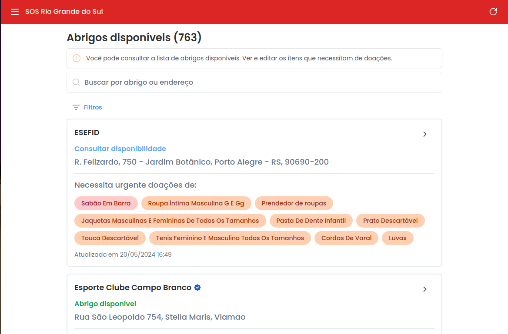

<!--
author:   Andrea Charão

email:    andrea@inf.ufsm.br

version:  0.0.1

language: PT-BR

narrator: Brazilian Portuguese Female

comment:  Material de apoio para a disciplina
          ELC1090 - Desenvolvimento de Software para Web
          da Universidade Federal de Santa Maria

translation: English  translations/English.md
-->

<!--
liascript-devserver --input README.md --port 3001 --live
https://liascript.github.io/course/?https://raw.githubusercontent.com/AndreaInfUFSM/elc1090-2024a/master/classes/15/README.md
-->

# Plataformas Web no apoio ao RS

## SOS-RS

https://sos-rs.com

## PetsRS

https://petsrs.com.br/

## Ache Seu Pet RS

https://www.acheseupetrs.com.br/

## Reconstroi RS

https://reconstroirs.me/

## Ajuda RS

https://ajudars.trindtech.com.br/plataforma/home

## Mapas

UFRGS

https://storymaps.arcgis.com/stories/a81d69f4bccf42989609e3fe64d8ef48

PoA

https://storymaps.arcgis.com/stories/02d01e5f3a2b423893a2b2560fa8ecce

