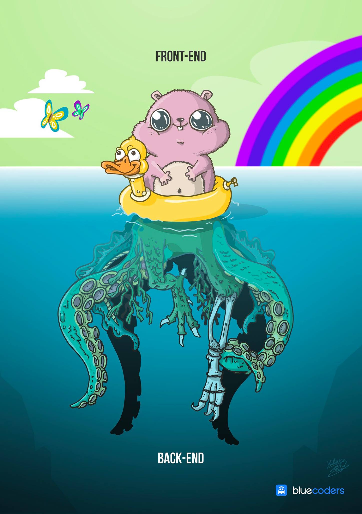
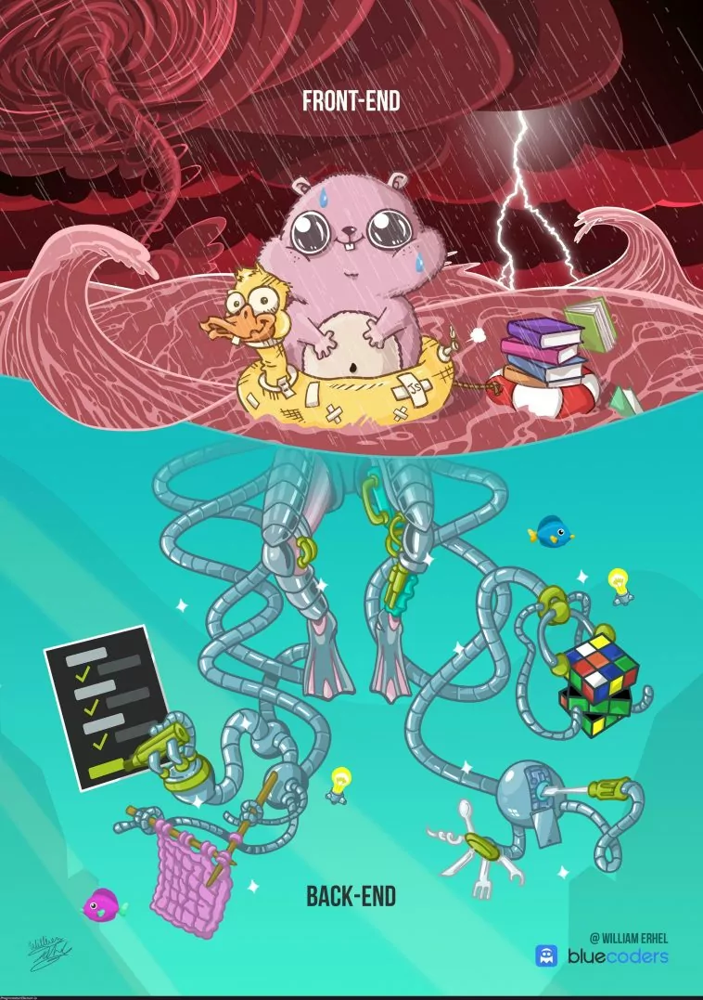
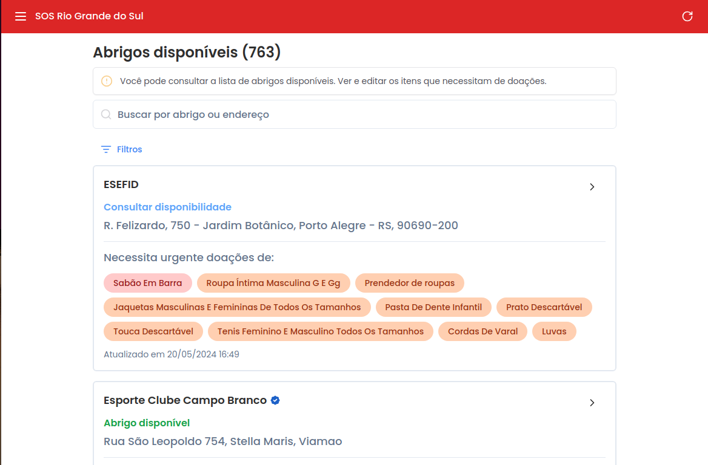
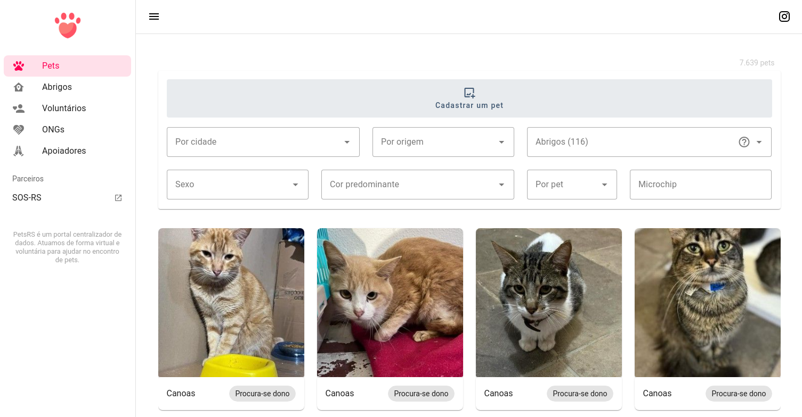
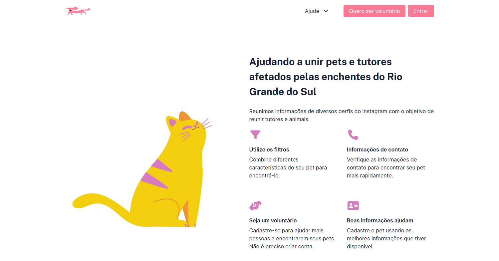
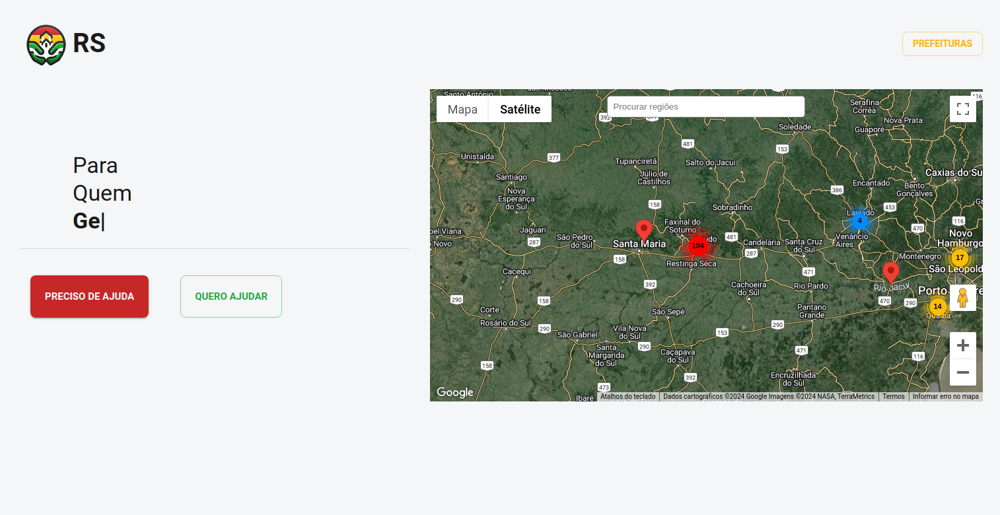
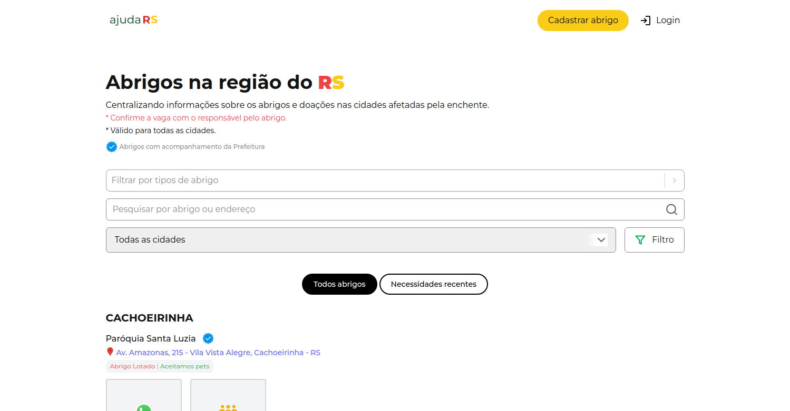

<!--
author:   Andrea Charão

email:    andrea@inf.ufsm.br

version:  0.0.1

language: PT-BR

narrator: Brazilian Portuguese Female

comment:  Material de apoio para a disciplina
          ELC1090 - Desenvolvimento de Software para Web
          da Universidade Federal de Santa Maria

translation: English  translations/English.md
-->

<!--
liascript-devserver --input README.md --port 3001 --live
https://liascript.github.io/course/?https://raw.githubusercontent.com/AndreaInfUFSM/elc1090-2023a/master/classes/17/README.md
-->

# Terceiro projeto

> Objetivo: Criar aplicação web com backend / persistência de dados em servidor, de preferência incluindo um CRUD 

 
  

## Temática

> Contribuição ao enfrentamento do desastre climático no RS

## Sugestões

- Criar algo simples, mas preenchendo algum nicho não atendido pelas soluções que surgiram recentemente
- Poucas regras de negócio (sugestão recebida)
- Avance para ver sugestões de colegas e da professora

### Temas de hackatons / desafios

Temática muito ampla? Veja categorias de problemas listados em sites de hackatons lançados recentemente

- Maratona Tech pelo RS (encerrada): https://www.sympla.com.br/evento-online/maratona-tech-pelo-rs/2470722  (sugestão recebida)
- HS Clima (encerrada): http://hackathon.sbc.org.br/hsclima/
- Formulário "Mudanças Climáticas: Catálogo de soluções para prevenção e mitigação de danos resultantes de desastres climáticos no RS": https://docs.google.com/forms/d/e/1FAIpQLSd_Z1EbDMUhlZB1yXWaByJHvsQZFYCbtqg7vG-JR-RjQylCJg/viewform

   
### Apoio à busca de emprego

- Sugestão recebida: cadastro de currículos
- Público-alvo: população menos incluída digitalmente (LinkedIn não seria alternativa)
- Motivação/objetivo: contribuir com quem está buscando emprego / contratando de forma emergencial
- Bom tema para exercitar CRUD
- Já foi tema de uma dupla em PSII (Viviane Endler e Leonardo Trindade, 2021b)

  - Modelagem de dados: [diagrama](https://online.visual-paradigm.com/app/diagrams/#diagram:proj=0&external=https://lpgsybpjon.us-07.visual-paradigm.com/rest/diagrams/shares/diagram/89704d5a-1138-4591-98f9-4737dd7d317f/content&name=Projeto%20de%20Software%20II.vpd) - quem usar deve citar!

### Visibilidade para reconstrução 

- Site para dar visibilidade (com entrevistas / registros estruturados) sobre pessoas trabalhando no restabelecimento de serviços essenciais
- Motivação: 

  - muitos serviços essenciais estão sendo restabelecidos por pessoas "anônimas" que estão trabalhando na linha de frente da reconstrução (limpeza, água, estradas, telecomunicações,...)
  - sites de notícias / redes sociais às vezes entrevistam essas pessoas, mas poderíamos ter mais informações (registro histórico)

- Público-alvo: população em geral / profissionais/voluntários de comunicação / trabalhadores
- Bom tema para explorar bancos de dados não-relacionais

### Controle de estoque para abrigos

- Web app simplificado para controle de estoque de abrigos, com estimativa de necessidades
- Motivação:

  - doações que chegam em locais de abrigo precisam ser gerenciadas de forma descomplicada
  - estimativas de necessidades podem ser simuladas em diferentes cenários

- Público-alvo: gestores de estoques/abrigos
- Bom tema para integrar com cálculos simples no backend

## Como?

- Trabalho em dupla

- Alternativas de desenvolvimento:

  1. usar os recursos exercitados na última aula (HTML, CSS/Bootstrap e JavaScript) ou 
  2. escolher algum framework que você já conheça ou deseje conhecer

- Deploy obrigatório!

- Autenticação pode ser deixada de lado

## Repositório de entrega

Repositório da dupla

- Primeiro integrante da dupla que clicar no link vai criar um grupo
- Segundo integrante da dupla vai clicar no link e selecionar o mesmo grupo

> Clique abaixo para criar o repositório de entrega:

https://classroom.github.com/a/f1EQ2jX8

### Validação da proposta

- Cada dupla vai preencher sua proposta no README do repositório
- A proposta será validada pela professora

## Entrega: datas

- a definir: Repositório atualizado, deploy realizado
- a definir: Apresentação