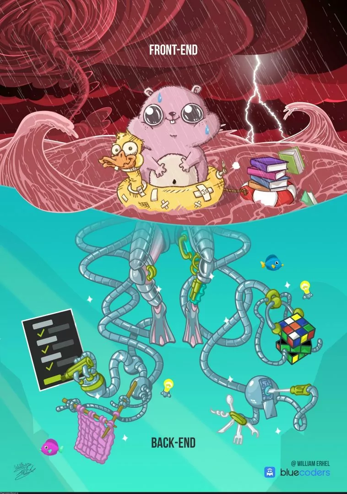

<!--
author:   Andrea Charão

email:    andrea@inf.ufsm.br

version:  0.0.1

language: PT-BR

narrator: Brazilian Portuguese Female

comment:  Material de apoio para a disciplina
          ELC1090 - Desenvolvimento de Software para Web
          da Universidade Federal de Santa Maria

translation: English  translations/English.md
-->

<!--
liascript-devserver --input README.md --port 3001 --live
https://liascript.github.io/course/?https://raw.githubusercontent.com/AndreaInfUFSM/elc1090-2024a/master/classes/12/README.md
-->

# Apresentações do terceiro projeto

> Objetivo: Criar aplicação web com backend / persistência de dados em servidor

 
  

## Temática

> Contribuição ao enfrentamento do desastre climático no RS

Algumas ideias:

- Apoio à busca de emprego
- Visibilidade para reconstrução 
- Controle de estoque para abrigos

## Trabalhos

Avance para ver cada trabalho...

### Ivan, Matheus e Marcos

Tema: Controle de estoque para abrigos

Tecnologias: HTML+CSS+JavaScript, Node.js, Express, MongoDB, outras

Repo: https://github.com/elc1090/project3-2024a-ivan-matheus-marcos

Deploy: https://estoque2024-492b6860c2a5.herokuapp.com/

### Flávio e Jhuan

Tema: Adote Minha Casa

Tecnologias: Vue.js, Adonis, MySQL ?

Repo: https://github.com/elc1090/project3-2024a-flavio-jhuan-1

Deploy: ?

### Renan e Thales

Tema: Controle de estoque para abrigos

Tecnologias: Laravel, Vue, SQL ?

Repo: https://github.com/elc1090/project3-2024a-renan-e-thales

Deploy: ?

### Alfredo e Pedro Henrique

Tema: Currículos (apoio à busca de emprego)

Tecnologias: React, Node/Express, SQL ? (mudou tudo?)

Repo: https://github.com/elc1090/project3-2024a-alfredo-pedro

Deploy: ?

### Mauro e Ramon

Tema: Controle de estoque para abrigos

Tecnologias: React, MongoDB ?

Repo: https://github.com/elc1090/project3-2024a-mauro-ramon

Deploy: ?

### Anthony e Luiz Felipe

Tema: Controle de estoque para abrigos

Tecnologias: React, Node/Express, PostgreSQL ?

Repo: https://github.com/elc1090/project3-2024a-anthony-luizfelipe

Deploy: ?

### Matheus D.

Tema: Currículos (apoio à busca de emprego)

Tecnologias: Laravel

Repo: ?

Deploy: ?

### Weverton

Tema: Entrevistas / Reconstrução

Tecnologias: React, Node, MongoDB

Repo: ?

Deploy: ?